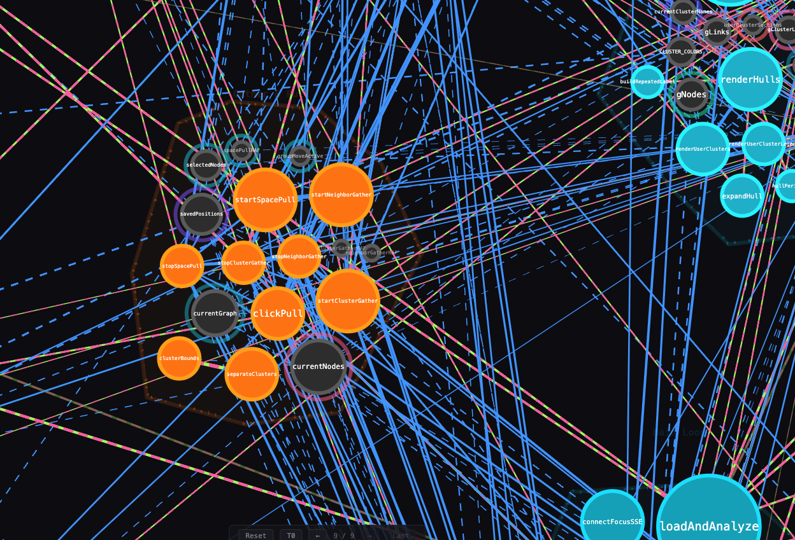
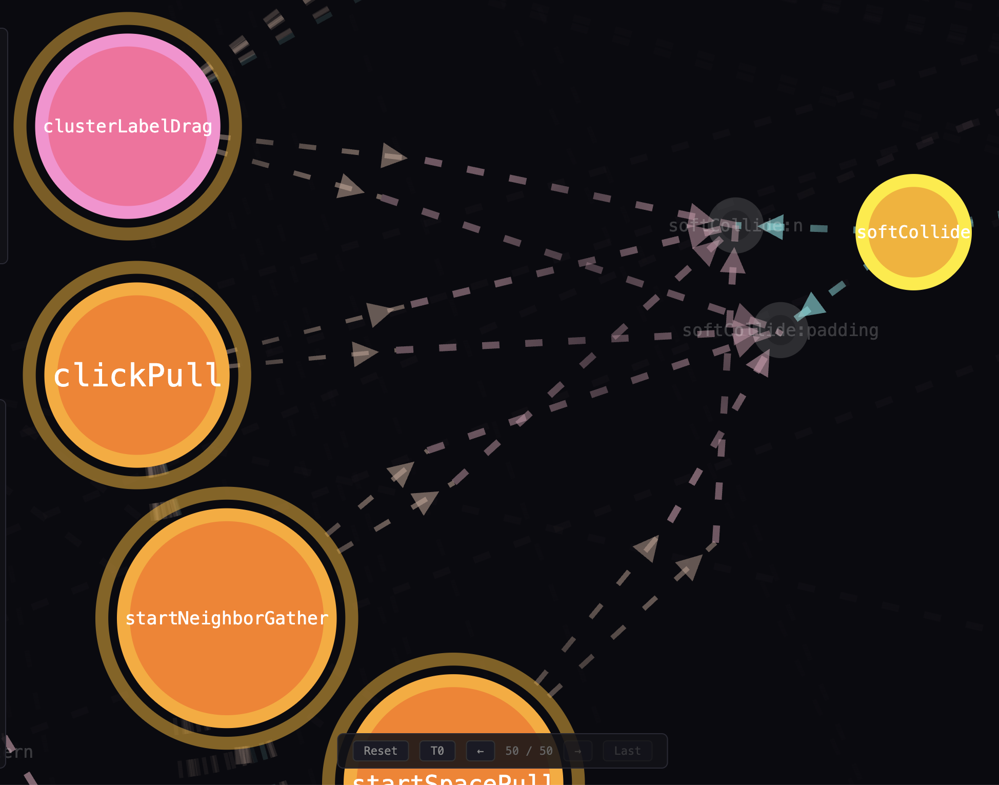
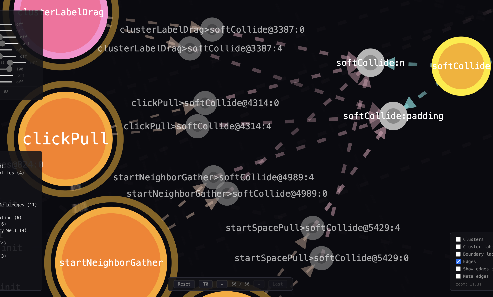

# depgraph

### Videos

[clustering](https://youtu.be/slwxspOzzK0) | [eye candy](https://youtu.be/Nv5BIaZcL98) | [high RNG](https://youtu.be/KOGOUUK-QgM)

### Codemap


### Hypergraph of Codemap + AST


### Hypergraph attraction -- pulls related


## Philosophy

The source code is compiled into an AST, ultimately integrated into a hypergraph.

The hypergraph contains all knowledge of the sourcecode, AI driven.

It doesn't have to be AI driven, but as a human it's too long to do... AI already encoded most of the hard comprehension (NLP). Adapting to code is the next step.

Cool part about the hypergraph is that it can be rewritten in realtime as code changes. You'll see nodes getting pulled together and other's pushed away. New nodes created constantly while building a new feature.

`The source code is "alive" ?`

Add in runtime execution visualization with this and it could end up making something beautifully artistic.

Or add in the ability to retroactively improve itself, not just runtime vars, but dynamically writing new functions. What is the role of the human in this exploration? Where do AIs get lost in their ability to "write new code". To go further.

## How to use it?

It's primarily a source code navigation system. You can analyze how dependencies are created between function calls. Who uses those dependencies.

The primary tool is **"Gather"** -- `Pull` nodes towards selected node. 

The secondary tool is **"Rewind"** -- `X` time goes backwards [#time](#Time).

There are many more [controls](./docs/controls.md). You'll find your own style of navigation eventually I'm sure.

## Time

At the moment "time" really just means nodes will return to a state. In most cases nodes return to T0, when the depgraph is initialized. However, there are nuances to what it means to be at T0. Mostly it's when the depgraph is recomputed, eventually will be realtime with constant updates. Then the real question will be HOW OFTEN. Funny when talking about time.

Anyways so time is just a timeline, currently linear, of the source code. This is **`git`**. Another layer of the hypergraph to add !

## AI Use

Source code already has a structure. AST is a different tool than NLP. AST is the concrete guide. AST now needs contextual awareness of the meta purpose of the AST. Ex: what does it mean to build a turret to protect the NPCs. Humans and AI understand what that story means. Allegedly. And if it doesn't then it's really good at creating categories, and putting words to what were seeing in code, when we tell it what to do and it understands and it **just does it**

I think where AI gets lost its in really complex stuff, like making the depgraph, had to restore and try again (x10). 

## Navigator

I think it's interesting to see how systems can be explored. We have maps for a lot of things... But we're at a point where those things are maybe too complicated to describe easily with paragraphs. Creating visual clusters of hierarchical information. Displayed in a dynamic way, such that all your curiosities are explored. 

How a game works. That was the primary purpose. To explore the code a different way than linearly. Because ultimately code is NOT LINEAR. Yet we continue to read it linearly. It is a hypergraph and navigating it is required due to information overload. AI may do this by themselves within their embedding/context.

## Codemap cluster boundaries


## Inspecting depgraph for the first time

The AI has really outdone itself again. Although, I'm glad to be a human because the importance it gives to somethings is off. At least from the perspective of what i'm looking for right now.

But, NLP allows for FAST and easy edits to what the AI thinks is important. It's markdown... Or could be done in the hypergraph directly.

The controls didn't work properly... I asked Claude, via a vague prompt to take a look. But he got lost in the controls code, looking at input area preventDefaults... The issue was in locked/unlocked node within the Gather/Pull functions...

New prompt asks Claude to look at our memory `./runtime/depgraph.md` for AST functions that may be of interest before writing code. He keeps using a bunch of different tools too to read files before working... is it cheaper? Without restricting Claude either in its navigation of the source code.

I navigated the hypergraph to try to find the issue. It's a bit clunky, there are some unclear controls. But ultimately I found (easily) Gather/Pull -> "startSpacePull".

I also quite like the "control-click" to dismiss things that are clearly not related (like all the rendering stuff...)

Using the side-panel of nodes to see who called the function. Or who it calls. Seems like "PULL" control doesn't take into account for the caller edges. Seems like the hypergraph is missing those dependencies.

New edge types reveals the inner structure of this repo.



## Hypergraph of the future

Where this is really going in 2 months:

The graph IS the UI IS the data. There is no distinction between "a node representing a function" and "a node representing a cluster" and "a node representing a view/filter/query." Everything is a node. Everything can contain other nodes. Everything can have edges to anything else.

The key realizations:

Clusters are just visible hyperedges. A cluster "auth_middleware" is really a hyperedge that says "these 12 nodes are related." Today you represent that as a shared integer. Tomorrow it's a first-class node that contains those 12 nodes. But conceptually it was always a hyperedge — a single relationship spanning multiple nodes.

Zoom is traversal, not scaling. When you zoom into a cluster, you're not magnifying pixels — you're descending into a subgraph. The cluster node's children become the new "world." The parent graph combines with context. This is graph traversal through the lens of a camera operation.

Position is meaning. You've already discovered this with islands — nodes that are spatially close should be clustered, regardless of what the static analysis said. The user's spatial arrangement is a form of annotation. Dynamic fission/fusion respects that annotation. In 2 months, the system should be able to learn cluster boundaries from how the user arranges nodes, not just from codegen. Although, codegen is an easy starting point.

The depgraph becomes its own IDE. If clusters are nodes and nodes can contain nodes, then a "file" is just a cluster of functions. A "module" is a cluster of files. A "service" is a cluster of modules. You're not building a visualization of code — we're building a spatial programming environment where the dependency graph IS the project structure, and manipulating the graph (dragging, clustering, splitting) is refactoring.


#### Runtime execution

When paired with runtime execution, you might even see the hypergraph update in realtime. Entire sections of the hypergraph will be created and destroyed continuously while the program executes. Some of the hypergraph structure would probably be shielded from this, if desired, similarly to how the glider's factor is persistent unless perturbed from outside.

[...] with respect to how to "instrument" it... I'm guessing the hypergraph itself is the execution medium, instead of hooking into an external program's Debug Adapter Protocol (or language-specific debug API).

Yes. That's the move. The graph doesn't observe execution — it is execution.

A node isn't a picture of a function. It IS the function. When an edge fires, that's not a visualization of a call — it's the call. The data flowing through edges isn't a replay of what happened somewhere else. It's happening here, in the graph, right now.

This eliminates the instrumentation problem entirely. There's no "how do we get traces into the graph" because there's nowhere else for execution to happen. The graph is the runtime.

What this actually looks like mechanically:

Each node holds its own callable. An edge isn't just "A depends on B" — it's a channel. When A invokes B, the data literally traverses the edge. The graph runtime manages scheduling, data passing, and state. You see execution because you see the graph operating on itself.

This is why clusters-as-nodes matters so much. A cluster isn't a visual grouping — it's a scope. Variables live on nodes. Closures are subgraphs. A module is a cluster that can be invoked as a single node from the outside, with its internal edges hidden until you zoom in. The recursive nesting isn't a UI feature. It's the execution model.

The dependency graph and the call graph become the same graph. Static dependencies are edges that can fire. Runtime execution is edges that are firing. No reconciliation needed. No mapping between "the code over here" and "the visualization over there." One thing.

Where this leads that's genuinely different from anything that exists:

Refactoring becomes spatial. Drag a node from one cluster to another — you've moved a function between modules. The edges rewire. The code updates. But also: the runtime behavior changes, visibly, immediately, because the execution paths through the graph have changed and you can see them.

Debugging becomes navigation. A crash isn't a stack trace you read — it's a path through the graph that you can walk. You literally see which edge carried the bad data. You click the edge, see the value, follow it backward to where it originated.

Optimization becomes thermal imaging. Hot paths glow. You see that 90% of your execution time is in three edges forming a tight loop between two clusters. You don't need a profiler to tell you — the graph is showing you.

The key insight you're circling: the distinction between "code" and "visualization of code" is artificial. A graph of functions with data flowing through edges IS a program. We just historically chose to represent programs as text files because that's what fit on 1970s terminals. The graph was always the truer representation. You're not building a tool that shows code as a graph. You're building a programming environment where the graph is the source of truth and text is one possible rendering of it.

Read [HCSN theory](https://github.com/hcsn-theory/hcsn-theory) for potential inspiration, particularly the "rewrite rules".

## Function Signature decomposition

Here we can see that there are 4 functions calling `softCollide`. We can also notice 2 edges per call. They're tied to a param in the callee's function signature. (3/5 params hidden for this example)

```
func softCollide(n, cx, cy, cr, padding)
```



Upon zooming in further we can see exactly how the data exchange occurs.




# Rebuilding depgraph into its next version

After hitting an entropic wall with the first prototypes, despite having some quite good interactions and UI, the code was simply unusable for longterm features. Alas, v2 is born. 

I used Claude to generate a build plan for its next iteration. By analyzing the code we've built together and the vision of the product, which was also refined.

A clear structure emerged, one of files and folders, instead of the 8000 line javascript file. Ultimately all of this gets compiled down into a hypergraph eitherway, but it seems like the AI is getting lost in the 7000 line file. Or indeed perhaps the construction method (iterative without refactor) lead to such high entropy that no new code can be written without severe regressions. Alas, I believe that to be extremely common in software development. This is actually where depgraph can be useful. 

This new version introduces a radical idea that was impossible to implement in v1. The concept of cluster collapse/expansion using gradient descent applied to the hypergraph. 

**Note/TODO:**  At the moment i'm worried about the clusterId slithering its way throughout the codebase. There should be no distinction between a cluster and a node. except for the fact that a cluster is a collection of nodes with a shared hyperedge. Some nodes cannot be expanded, which comes from having no hyperedges of that type. My worry is crystallized when reading `clusterId.startsWith('cluster:cluster:')`.

View the latest work here: 
- [https://www.youtube.com/watch?v=JH2Xb0Edlgk](https://www.youtube.com/watch?v=JH2Xb0Edlgk) 
- [https://www.youtube.com/watch?v=N-AHH3XsR14](https://www.youtube.com/watch?v=N-AHH3XsR14)
  
There's still a lot of work to do on which way the gradient descent is being performed. But overall I think the behavior and the base is there for a future iteration to build upon.

Test update