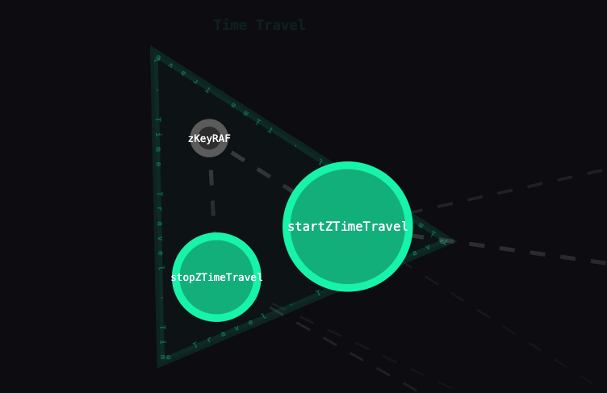

# depgraph todo

Run claude when the AST is done, and ask him to group them with respect to importance, and grouped by "idea", within the context of the repository its in.

Edge weights should change dynamically based on the current context the user is navigating. Please change the Time Arrows to be a bit more advanced. Goto T0, goto Last, 

zKeyRaf, it's being written to in zLoop which occurs INSIDE startZTimeTravel, but its not being shown as being written by startZTimeTravel. Most likely because its associated to zLoop... But zLoop is hidden because its a local function declaration... Although I might expect zLoop to also be a node defined in the hypergraph, this would require zoom-dependency. Because if i'm looking inside of the Time Travel cluster, 3 nodes only, I probably also want to see the internals of startZTimeTravel.

---

With respect to simulator adding nodes in realtime. I think that sometimes clusters don't even exist until they appear but the hypergraph isn't updated. I feel like when new nodes are added they should PULL and REPULSE based on the edges in the hypergraph. Maybe we need to create a new control that is "Apply Edge weights", perhaps that's what the "X" control should've been. But just to keep things distinct, a new control should be created. I propose F for forces.

---

Some of the cluster labels are rendered WAY too far away from their cluster. Perhaps it should be spring based? Or perhaps it has something to do with the cluster islands, ex: if the cluster is sparse, maybe we need to have multiple labels?! Maybe clusters should be more dynamic. Based on nodes in close proximity. Clusters can recombine together to form a bigger cluster, depending on its nodes' positions. I love the idea of clusters within clusters. Nodes within nodes. I think its time to start considering clusters as nodes.

---

There's an bug where if the cluster nodes are FAR away, the repulsion mechanism of cluster probably creates a centroid-repulsion. So everything gets repulsed around that centroid location. Resulting in some chaotic repulsion/pull forces. My guess is that cluster attraction is probably cheap to do, but its probably being done naively via meta edges. Those meta edges should instead create connectivity islands based on the position of the nodes in the UI too. Ex: a cluster with nodes that are physically far apart should probably create new meta edges, effectively separating the cluster. Perhaps.

---
Control + Clicking in white space should create a repulsion bubble at that location, not to be confused with "returning to their T0 position" which is the current behavior.

---
